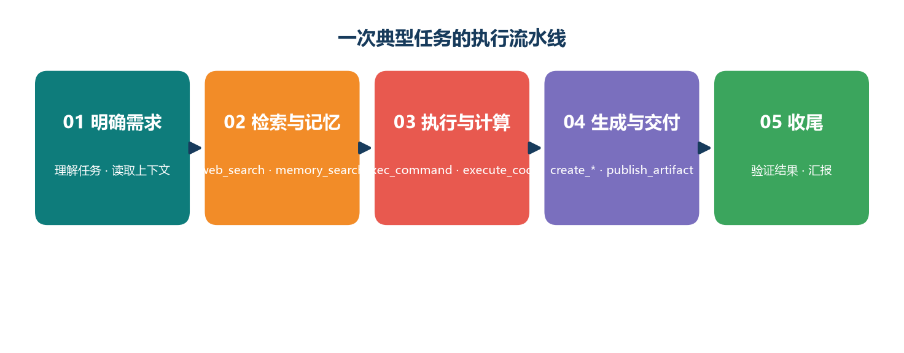
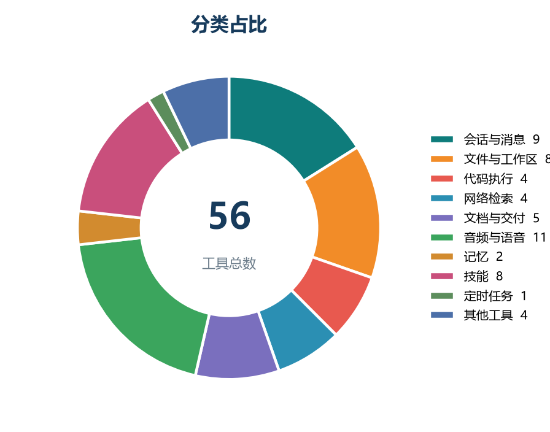

<p align="center">
  
</p>

<h1 align="center">PM 待办助手</h1>

<p align="center">
  <strong>本地优先的项目管理 / 待办桌面应用</strong><br>
  给同时盯多个项目、多张任务清单的项目经理：一个窗口看完所有项目，汇报弹药自动组装，数据 100% 留在本机。
</p>

<p align="center">
  <a href="https://github.com/wangjie-git/pm_tool/releases/latest"></a>
  
  
  
</p>

---

## 为什么需要它

项目管理的真实日常：任务散在 Excel、微信群、邮件和各业务系统里，手头同时压着三五个项目，还要应付日报、周报和随时会被问到的"什么时候能好"。

| 痛点 | 常见现状 | PM 待办助手的做法 |
| --- | --- | --- |
| **任务散落多端** | Excel、微信群、邮件各记各的，项目一多就乱 | 单一本地库统一收口：项目分组 + 收件箱分拣 + 跨项目「今日聚焦」驾驶舱，一个窗口看完所有项目 |
| **日报周报靠回忆** | 下班后对着空白文档拼"今天干了啥"，工时靠估 | 每日收尾三问（Sunsama 思路）+ 计时器自动汇总工时 + 风险 / 决策自动附上，一键推送到企微 / 钉钉 / 飞书群 |
| **交付日期靠拍脑袋** | 领导问"什么时候能好"，只能说个大概 | 甘特时间线 + **蒙特卡洛预测**（50% / 85% / 95% 置信日期），复制话术直接汇报 |
| **风险只活在人脑里** | 风险靠记忆和口头同步，出问题才想起来 | 概率 × 影响风险登记册，高风险标红置顶、自动进日报，并预先约定应对措施与升级条件 |
| **敏感数据不敢上云** | 项目信息涉密，SaaS 工具不让用、不敢用 | **100% 本地 SQLite**，无账户、可离线，启动自动备份（保留最近 30 份），可随时 JSON 导出带走 |
| **记录任务太费劲** | 五步弹窗填表单，想起来就不想记 | 自然语言一行建任务：`下周三 联调 @李四 !P0 #风险`；AI 粘贴整段会议记录自动拆成任务草稿，确认后才入库 |

一句话：**把项目经理从"记任务、拼汇报、估日期"里解放出来**，让记录成本趋近于零、汇报有数据支撑、承诺有时间线的依据。

## 核心特性

**多项目任务管理**

- **今日聚焦 · 三只青蛙（MIT）**：跨项目汇总今天到期 / 逾期 / 进行中的任务，按项目分组，一键复制清单发给团队
- **四种任务视图**：列表（搜索 / 筛选）、看板（拖拽 + WIP 超限提醒）、日历（循环任务虚线占位）、**甘特时间线**（自绘 SVG，日 / 周 / 月缩放，拖条改期，一键导出 PNG 汇报）
- **收件箱分拣**（Linear Triage 思路）：快速添加先进收件箱，侧栏逐条分派到项目
- 项目模板一键建项、里程碑、归档；任务可挂父任务，清单进度自动上卷
- **自然语言快速添加**：`下周三 闸机联调 @李四 !P0 #风险 #每周` —— 日期 / 负责人 / 优先级 / 标记一行解析（`今天 / 明天 / 下周三 / +3天 / 2026-09-14`）
- 任务计时 → 日报自动带工时；一键推迟 + 拖延徽章（推迟 ≥3 次亮 ⚠ 逼出决策）

**汇报与沟通**

- **风险登记册**：概率(1-5) × 影响(1-5) = 风险值，≥15 标红置顶并强制进日报风险栏，附应对措施 / 升级条件
- **每日收尾问答**（站会三问）：每天 17:30 弹"今天干成什么 / 卡在哪 / 明天三件事"，次日日报自动引用
- **日报 / 周报一键发群**：企业微信 / 钉钉（支持加签）/ 飞书群机器人 Webhook
- 项目决策日志（ADR）、会议纪要 → 行动项、干系人跟进、每日笔记、项目 one-pager 档案（自动嵌入任务表 / 风险册 / 预测 / 统计）

**洞察与统计**

- **蒙特卡洛交付预测**：🎯 50% / 85% / 95% 三档置信日期 + 直方图 + 一键复制汇报话术
- 吞吐量柱状图、Cycle Time 周期统计（平均处理时长 + 近 4 周逾期率趋势）、工时预算告警（80% / 100% 托盘通知 + 群推送）
- **RICE 需求池**：想法 / 需求按 价值÷工时 打分排序，四象限决策，一键转为任务
- 跨项目智能视图：内置「风险登记册 / 风险且逾期 / 等待超 3 天」，可保存自定义筛选

**自动化与 AI（可选）**

- 固定规则自动化：逾期自动置顶、停滞 14 天进待清理视图、完成自动停表、提醒附带收件箱数量
- **AI 提效三件套**：自定义模型供应商（预设智谱 GLM / DeepSeek / Kimi / 阿里云百炼 / SiliconFlow / OpenAI / OpenRouter / 本机 Ollama，或任何 OpenAI 兼容服务），多套档案一键切换；🤖 粘贴转任务、🤖 生成检查清单、日报 AI 润色——**AI 只产草稿，不直接改数据**
- 每日定时提醒、系统托盘常驻、启动时通知今日到期任务

**数据安全与桌面体验**

- 回收站 / 软删除（保留 30 天可恢复）、启动自动备份（30 份）、JSON 导入 / 导出、CSV 导出
- **Excel 双向闭环**：计划表导入向导（列映射 / 值映射 / 预览 / 导入报告，合并单元格自动填充、WBS 序号建层级、脏数据标黄）+ 导出带样式 .xlsx 发给甲方
- 全局快速捕获（Alt+Shift+A）、深链接 `pm-todo://task/123` + 单实例、任务栏进度条、开机自启、窗口状态记忆
- 明暗主题、Ctrl+K 命令面板、完整快捷键（N 新建、1-4 切换任务视图、/ 搜索）

## 界面一览

| 产品流程总览 | 统计与交付预测 |
| --- | --- |
|  |  |

更多界面截图见 `assets/manual_imgs/`，完整图文说明见《[PM待办助手-使用手册.docx](PM待办助手-使用手册.docx)》。

## 技术栈

| 层 | 选型 |
| --- | --- |
| 界面框架 | [Tauri 2](https://tauri.app)（Rust + WebView2，安装包约几 MB） |
| 前端 | 原生 HTML / CSS / 纯 ES Modules（**无打包器、无框架依赖**） |
| 数据存储 | SQLite（单文件，100% 本机，随时可备份带走） |
| 集成 | 企业微信 / 钉钉 / 飞书 Webhook、OpenAI 兼容 AI 接口、`pm-todo://` 深链接 |

## 下载安装

到 [Releases](https://github.com/wangjie-git/pm_tool/releases/latest) 页面下载 `PMTodoAssistant_x.x.x_x64-setup.exe`（资产中文名见其 label），双击安装即可。

- 支持 Windows 10 / 11，安装时自动处理 WebView2 运行时
- 当前版本 **v2.2.0**：界面重构（侧栏分组 / 两层页签 / 项目工具菜单）+ 后端模块化

**快速上手**（10 秒学会核心操作）：

```
下周三 联调 @李四 !P0 #风险     ← 在任意输入框敲这一行，任务就建好了
📥 先进收件箱再分派              ← 不急着定项目就先进收件箱
⏰ 17:30 收尾三问                ← 记完三问，明天的日报自动引用
🧮 统计页看预测                  ← 领导问交付日期，答案在这里
```

## 从源码构建

依赖：Rust（MSVC 工具链）、WebView2（Win10/11 通常已内置）。

```bash
# 安装 Rust（Windows 也可使用本仓库 tools/install-rust.cmd 的便携方案）
rustup default stable

# 安装 Tauri CLI
cargo install tauri-cli

# 开发调试
cargo tauri dev

# 打包 Windows 安装包（NSIS）
cargo tauri build
```

产物位于 `src-tauri/target/release/bundle/nsis/`。

## 参与开发

**代码结构**：前端在 `ui/`（纯 ES Modules，入口 `ui/js/app.js`）；后端在 `src-tauri/src/`（Rust 模块：`main.rs` + `state/models/db/tasks/journal/timer/webhook/ai/import_export/system`），命令按 `模块::命令` 注册于 `main.rs` 的 `generate_handler!`。

**改完代码跑检查**：

```bash
node tools/check_ids.js        # $id 引用与 onclick 函数静态检查
node tools/check_commands.js   # 前端 invoke 命令 vs 后端 #[tauri::command] 交叉比对
```

**浏览器预览**（mock 后端，数据存 localStorage，无需 Rust 环境）：

```bash
node tools/serve-ui.js   # 然后访问 http://127.0.0.1:8123/
```

**发布新版本**：仓库配置了 GitHub Actions，推送 `v` 开头的标签即自动编译并发布 Release（版本号与 `src-tauri/tauri.conf.json` 一致，也可在 Actions 页面手动触发）：

```bash
git tag v2.0.0 && git push origin v2.0.0
```

**项目文档**：功能选型调研与实现说明见 [docs/](docs/)（UI 重构方案、第三轮 / 增补方案、实施记录等）。

## 设计理念

- **本地优先，隐私默认**：无账户、无云依赖、无遥测，数据是你的，备份是你自己的
- **记录成本趋近于零**：快速添加语法 + 收件箱 + AI 草稿，让"记下来"不再有门槛
- **汇报不是额外工作**：日常记录的副产品——日报、周报、预测自动组装，顺手推群
- **不堆砌重流程**：借鉴 Linear / Sunsama / Reclaim / Super Productivity 等产品思路，只做项目经理真正会用的轻量功能

## 许可证

[MIT](LICENSE)